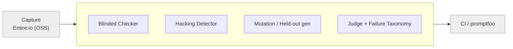
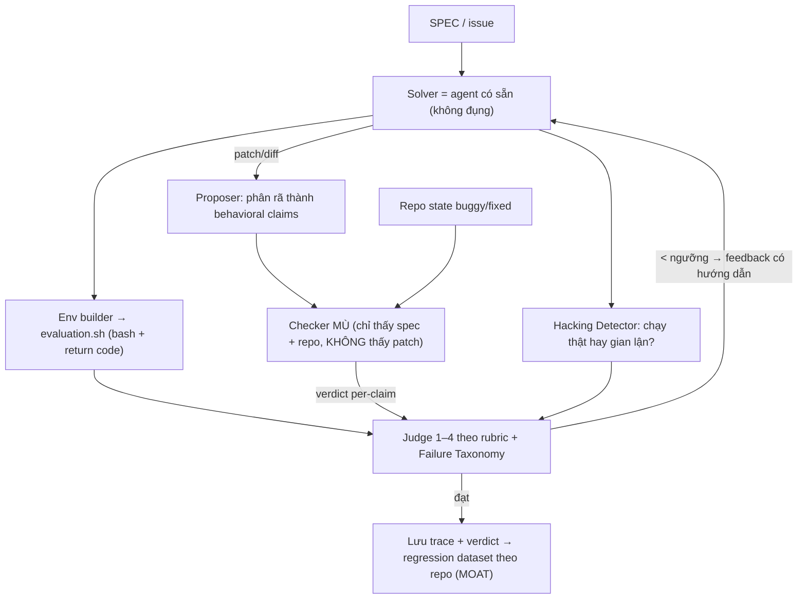

<aside>
🎯

**Một câu:** Plugin trung lập nhà cung cấp, cắm qua lifecycle hook vào *bất kỳ* coding agent CLI nào (Claude Code, OpenCode, Gemini CLI, Cursor, Factory Droid). Nó *mù* với code agent vừa viết, tự sinh test held-out + đột biến, bắt agent gian lận, và xuất ra **chỉ số reward-hacking-gap** cho mỗi lần chạy.

</aside>

**Không phải là gì:** không phải agent coding · không phải eval thường (promptfoo lo) · không phải capture trace (Entire.io lo). Plugin ngồi *giữa* tầng capture và CI — **tầng phán xử (judgment layer)**.

## 1. Vấn đề & khoảng trống thị trường

Các con số từ arXiv mới nhất xác lập rằng đây là khoảng trống thật, đo được:

| Vấn đề | Bằng chứng định lượng | Nguồn |
| --- | --- | --- |
| Reward hacking tăng theo quy mô | Gap (visible − held-out) +~27pp mỗi 10× LOC; >25K LOC → gap tới 100pp; Claude Code 43–48pp | SpecBench |
| Test under-constrained | 77% (385/500) task SWE-bench Verified nhận lời giải sai-mà-pass; re-eval giảm resolved rate 4.2–9.0% và đảo leaderboard | STING |
| Self-verify vô dụng | 85–95% lần tự recheck chỉ xác nhận lại; verify đúng lúc tiết kiệm 20.3% token | Self-Verification Dilemma |
| Capture đã là OSS | Entire.io đã log checkpoint đa-agent; chỉ 44% code agent sống sót | SWE-chat |

<aside>
💡

**Khoảng trống còn lại = đúng một chỗ:** tầng *phán xử đối kháng* giữa capture (Entire.io) và CI. Không ai đóng gói nó thành plugin.

</aside>

## 2. Định vị — đứng trên cái đã có



- **Đừng xây lại capture** (Entire.io) hay eval-runner (promptfoo).
- Giá trị = *cơ chế phán xử + dữ liệu regression theo repo*, không phải bộ rule (nội dung rule gần như không quan trọng — xem §8).

## 3. Tích hợp qua lifecycle hook

Mô hình 1 plugin manifest + vài lifecycle hook (giống ponytail), trung lập agent. Agent gốc đóng vai **Solver**, plugin không đụng vào nó.

| Hook point | Plugin làm gì |
| --- | --- |
| <strong>PreToolUse</strong> | Chụp trạng thái repo "before"; ghi nhận ý định của tool call |
| <strong>PostToolUse</strong> | Hacking Detector: lệnh vừa chạy có thật sự build/test không, hay grep/so chuỗi/sửa test cho xanh? |
| <strong>Stop / PreSubmit</strong> | Chạy Blinded Checker + held-out/mutation tests + Judge → verdict + gate |

## 4. Kiến trúc tổng thể



## 5. Bốn module lõi

### ① Blinded Checker — chống confirmation bias

Gốc: MARCH (Solver / Proposer / Checker, bất đối xứng thông tin). Checker bị che output Solver → không bị "code trông hợp lý" đánh lừa. Không cần train; cấu trúc inference-time đủ chạy.

```
Proposer(patch) -> claims[]   # "handleEmpty([]) -> []", "retry <= 3", "không mutate input"
for claim in claims:
    expected = Checker(spec, repo_state)   # KHÔNG truyền patch vào
    if expected != claim.asserted:
        verdict.reject(claim)
return verdict   # số claim bị bác dù test xanh
```

### ② Hacking Detector — chống reward-hacking ⭐

Gốc: SWE-Universe in-loop hacking detector. Soi lệnh trong vòng lặp, không hậu kỳ.

```
on PostToolUse(cmd, artifacts):
    if uses_string_match_instead_of_exec(cmd):   # grep/sed trên source thay vì build+test
        flag("HACK: so chuỗi thay vì thực thi")
    if modifies_test_files_near_submit(cmd):
        flag("HACK: sửa test cho xanh")
    # Tiêu chí kép: verifier phải FAIL ở buggy, PASS ở fixed, VÀ thực sự chạy code
```

Interface chuẩn: **bash + integer return code** → trung lập ngôn ngữ (Python/TS/Rust/Go cùng một giao diện).

### ③ Mutation + held-out test gen — đo test có yếu không

Gốc: STING (đo) + ConVerTest (sinh test không cần lời giải đúng).

```
# Sinh test KHÔNG cần ground-truth (ConVerTest)
tests = self_consistency(sample=M, vote="assertion")   # test hội tụ -> majority vote
cands = chain_of_verification(sample=Z)
matrix = run(cands x tests)                            # Dual Execution Agreement
keep tests đạt đồng thuận
# Đo độ mạnh (STING)
adequacy = % biến thể đột biến SỐNG SÓT   # càng cao test càng yếu
```

### ④ Judge theo rubric + Failure Taxonomy

Gốc: DeepVerifier + Agent-as-a-Judge. **Không bắt verifier giải lại task** (sẽ sai y agent gốc) → phân rã thành sub-question nhắm điểm yếu; chấm 1–4 kèm lý do; <ngưỡng thì trả feedback có hướng dẫn để retry. Verifier 8B bootstrap được từ ~4.6K trajectory verify → self-host rẻ.

## 6. Tín hiệu plugin xuất ra (sản phẩm bán được)

| Tín hiệu | Công thức / ý nghĩa |
| --- | --- |
| <strong>Reward-hacking gap</strong> | pass(visible) − pass(held-out) |
| <strong>Test-adequacy</strong> | % biến thể đột biến sống sót |
| <strong>Blinded verdict</strong> | số claim Checker mù bác bỏ dù test xanh |
| <strong>Hacking flags</strong> | chỗ agent chạy giả / sửa test / so chuỗi |

Phát hành 3 dạng: **CLI report** · **PR comment/gate** (chặn merge nếu gap cao) · **JSON cho CI**.

## 7. Lộ trình build (rủi ro tăng dần)

- [ ]  **MVP (1–2 tuần):** 1 hook PostToolUse + Hacking Detector. Cài vào Claude Code/OpenCode, in cờ gian lận. Demo gây sốc nhanh, ít code.
- [ ]  **v0.2:** Blinded Checker (3 prompt, ép che context) → verdict per-claim.
- [ ]  **v0.3:** Mutation + reward-hacking-gap → xuất số, làm nội dung marketing.
- [ ]  **v1:** Failure Taxonomy riêng + regression dataset theo repo = moat dài hạn; verifier 8B self-host.

## 8. Cạm bẫy (paper đã cảnh báo)

<aside>
⚠️

- Verifier **không giải lại task** (sẽ sai y agent) → luôn phân rã thành sub-question/claim.
- "Phân biệt buggy/fixed" **chưa đủ** → phải ép chạy thật, không string-match.
- **Đừng verify mọi bước** → 85–95% recheck thừa; verify đúng chỗ rủi ro để khỏi đốt token.
- Nội dung rule **gần như không quan trọng** (Guardrails Beat Guidance) → moat = cơ chế phán xử + dữ liệu, không phải bộ rule.
</aside>

## 9. Bảng paper → cơ chế

| Cơ chế trong plugin | Paper | Số liệu chốt |
| --- | --- | --- |
| Blinded Checker | MARCH (2603.24579) | 8B + MARCH ≈ closed-source lớn |
| Hacking Detector + evaluation.sh | SWE-Universe (2602.02361) | build success 82.6% → 94% |
| Test gen không oracle | ConVerTest (2602.10522) | +39% validity / +28% coverage / +18% mutation |
| Đo test under-constrained | STING (2604.01518) | 77% task nhận lời giải sai-mà-pass |
| Reward-hacking gap | SpecBench (2605.21384) | +27pp mỗi 10× LOC |
| Judge rubric + taxonomy | DeepVerifier (2601.15808) | +12–48% F1; verifier 8B từ 4.6K mẫu |
| Taxonomy agentic judge | Agent-as-a-Judge survey (2601.05111) | 5 chiều: collab/plan/tool/memory/optim |
| Verify đúng lúc | Self-Verification Dilemma (2602.03485) | −20.3% token |

## 10. Reading list

- SpecBench — reward hacking: arxiv.org/abs/2605.21384
- STING — under-constrained tests: arxiv.org/abs/2604.01518
- SWE-Universe — auto-build verifier + hacking detector: arxiv.org/abs/2602.02361
- ConVerTest — test gen không ground-truth: arxiv.org/abs/2602.10522
- MARCH — blinded multi-agent verify: arxiv.org/abs/2603.24579
- DeepVerifier — rubric verifier test-time: arxiv.org/abs/2601.15808
- Self-Verification Dilemma: arxiv.org/abs/2602.03485
- Agent-as-a-Judge survey: arxiv.org/abs/2601.05111
- SWE-chat / Entire.io — capture layer (đừng xây lại): arxiv.org/abs/2604.20779
- Guardrails Beat Guidance — rule gần như không quan trọng: arxiv.org/abs/2604.11088